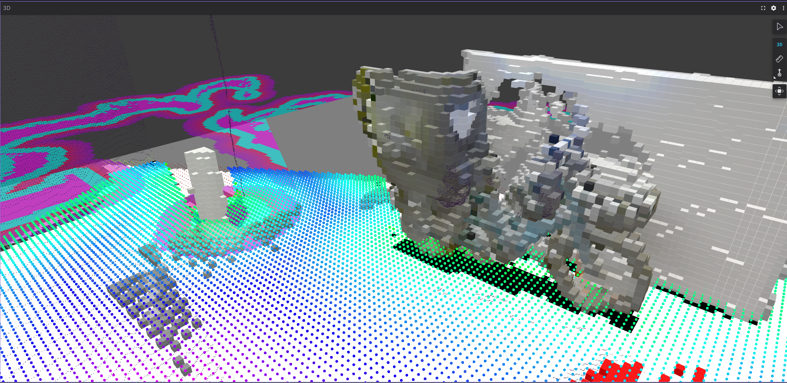

# opennav_visual_navigation

This repository pairs with the [tutorial on docs.nav2.org](https://docs.nav2.org/tutorials/docs/using_isaac_perceptor.html) showcasing vision-only navigation using Nav2 and NVIDIA Isaac and Perceptor SDKs.
This fully replaces the use of lidars and active depth cameras to perform navigation using only stereo cameras for mapping, localization, and collision avoidance.
Please reference this tutorial for more information.
**Click on the image below to see a video demonstration of the system in action!**

The repository contains the scripts, example maps, graphics, and software version information used for the tutorial.

This project relies on the [NVIDIA Nova Carter project](https://github.com/NVIDIA-ISAAC-ROS/nova_carter) which uses the Segway Nova Carter robot powered by an NVIDIA [Jetson AGX Orin](https://amzn.to/4k8jiQh) to conduct vision-based navigation.
This robot was preconfigured by Open Navigation in coordination with NVIDIA Robotics to use ROS 2 and Nav2, so we use these established configurations for this technology demonstration.
That project contains the robot-specific bringup and Perceptor configurations using its [NVIDIA Nova](https://nvidia-isaac-ros.github.io/nova/index.html) reference platform for camera capture and synchronization.

To adapt to another platform, make a new `my_robot_nav` package which:
* Launches the robot hardware drivers for accepting commands, bringing up sensors, providing transformation tree, etc
* Launches Isaac Perceptor, usually via `isaac_ros_perceptor_bringup` package's `perceptor_general.launch.py` or `perceptor_rgbd.launch.py`
* Launches Nav2 with the appropriate configurations (i.e. removed AMCL for cuVSLAM, Costmap configurations for NvBlox)

Use these launch files to replace `nova_carter_bringup/launch/navigation.launch.py` used in this package. More information is provided in the tutorial -- happy visual navigating! 

